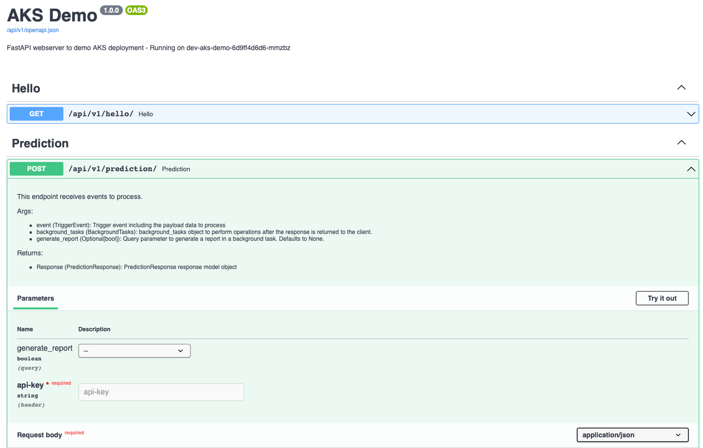
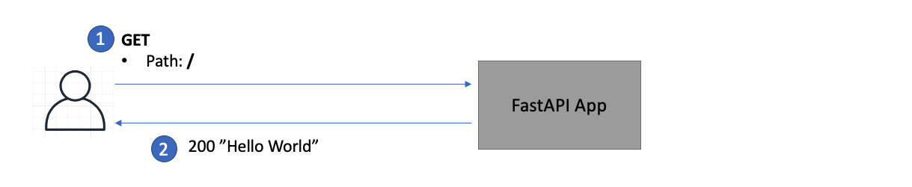
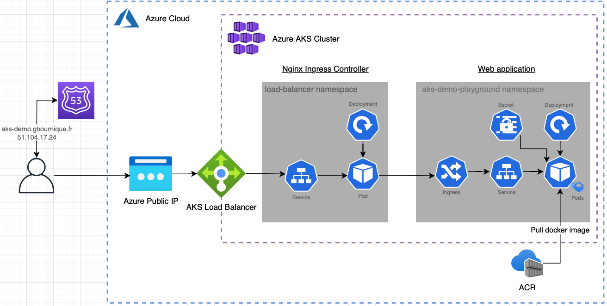
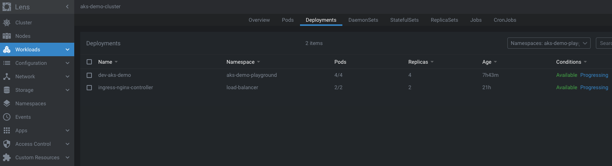

[](https://circleci.com/gh/gbourniq/aks_demo)
[](https://github.com/pre-commit/pre-commit)
[](https://github.com/psf/black)

# AKS Demo

## Overview

This repository consists of the following exercise:
1.	Develop a simple app in python 3.X
2.	Package the application in a Docker container. 
3.	Spin up an Azure Kubernetes Cluster and an Azure Container Register in Azure
4.	Tag and push the app to the ACR. 
5.	Deploy the container as a Deployment in the AKS Cluster. 
6.	Expose the deployment through a public endpoint.
7.  Develop a CI/CD pipeline for continuous deployment on new commits to the master branch

## Content

- [Application overview](#application-overview)
  - FastAPI as a python web framework
  - APIs overview
- [Local development](#local-development)
	- Prerequisites
  - Use the Makefile!
  - Virtual environment, python dependencies and githooks
  - Unit-tests and coverage
  - Run the webserver locally
- [Build and publish docker image to ACR](#build-and-publish-docker-image-to-acr)
  - ACR setup
  - Build docker image
  - Publish docker image to ACR
- [AKS deployment](#aks-deployment)
	- Create the AKS cluster
	- Connect to AKS with Lens
  - Create an Azure Public IP
  - Deploy the Nginx ingress controller
  - Deploy the application to AKS with Helm
  - Cluster auto-scaling
- [CI/CD](#cicd)
  - Containerised build steps
  - CircleCI setup
- [Future improvements](#future-improvements)

## Application overview

#### FastAPI as a python web framework

<p align="center"><i>Swagger docs generated automatically by FastAPI</i></p>


<p align="center"><i>Swagger docs generated automatically by FastAPI</i></p>

FastAPI is chosen as a python backend web framework for the following reasons:
- Modern web framework and simple set up
- Automated swagger docs generation, from docstrings, type hints, etc.
- Data validation for incoming and outgoing requests using `pydantic` to detect invalid data at runtime. Exception handling is made really simple. See `aks_demo/models/input.py` and `aks_demo/models/input.py`

#### APIs overview

The simple web application exposes 2 endpoints.

<p align="center">
  
  <i>GET endpoint at '/'</i>
</p>

The `GET` endpoint is defined in `aks_demo/api/endpoints/v1/hello.py` and returns "Hello world".

<p align="center">
  
  <i>POST endpoint at '/prediction'</i>
</p>

The `POST` endpoint is defined in `aks_demo/api/endpoints/v1/prediction.py` and returns a mock predicted data based on a given input.

> Note the secret key header `x-api-key` used to secure this endpoint. If an invlid key is supplied, the endpoint returns a `418`. This is handled using FastAPI `dependencies`, see `aks_demo/api/dependencies/common.py`.

> The optional query parameter `generate_report` (boolean) is used to start a fastapi `background task` after the request has been returned to the client.


## Local development

### Prerequisites
- Clone the [aks_demo](ssh://git@github.com:gbourniq/aks_demo.git) repository and cd into it
- Install [Miniconda](https://docs.conda.io/en/latest/miniconda.html)
- Install [Poetry](https://github.com/sdispater/poetry)

### Use the Makefile!

A `Makefile` is available to conveniently run any useful setup, development and deployment commands.

### Virtual environment, dependencies and githooks

Set up conda environment with `environment.yaml` and install poetry dependencies defined in `poetry.toml`
```
make env                         
make env-update
```

> The manual equivalent is `conda env create -f environment.yml` and `poetry install` to resolve and install the dependencies. A `poetry.lock` file will be generate with the package versions which were resolved.

The git-hooks are managed by the [pre-commit](https://pypi.org/project/pre-commit/) package and defined in `.pre-commit-config.yaml`. They are automatically run on each commit, consists of the following tools:
* `autoflake`: remove unused variables and imports
* `isort`: sort imports
* `black`: format python code
* `yamllint`: format yaml code
* `pylint`: code analysis rating based on PEP8 conventions

To install the pre-commit hooks:
```
make pre-commit
```

To manually run the githook:
```
make lint
```

### Unit-tests and coverage

Unit tests are defined in `aks_demo/api/endpoints/v1/tests`.

Run the unit tests and view coverage with:
```
make test
make cov
```

### Run the webserver locally

Run the webserver locally with:
```
make run
```
## Build and publish docker image to ACR

#### ACR setup
1. Create an ACR service from the Azure portal
2. Enable password authentication (required for the circleci ci/cd pipeline)
3. Login to ACR via `az login` or the password authenticaion:
```
echo ${ACR_PASSWORD} | docker login gbournique.azurecr.io --username gbournique --password-stdin 2>&1
```

#### Build docker image

The fastapi docker image can be built with `make build` which is using the Dockerfile in `deployment/Dockerfile`. Image name and tag can be set directly in the `Makefile` under `# Environment variables`.

#### Publish image to ACR

To push the image to ACR, run `docker push <docker-registry-url>/<registry-name>/<image-name>:<image-tag>`, e.g:
```
docker push gbournique.azurecr.io/gbournique/aks_demo:latest
```

## AKS deployment

This section includes steps to create the following kubernetes cluster.

<p align="center">
  
  <i>Kubernetes architecture</i>
</p>

### Create and connect to the AKS cluster

#### Prerequisites
Install `azure-cli`, `kubectl`, and `helm`. On macOS:
```
brew install azure-cli
brew install kubectl
brew install helm
```

#### Create the AKS cluster

Create the cluster from the Azure portal.

> The cluster should be enabled with `auto scaling` so that new worker nodes are created when kubernetes deployments are scaled up.

> The `service principal` authenticatiom method is chosen here instead of the `System-assigned managed identity` so that our 3rd party CI/CD tool can connect to the cluster via service principal credentials.

Useful links:
* https://docs.microsoft.com/en-us/azure/aks/kubernetes-service-principal?tabs=azure-cli
* https://docs.microsoft.com/en-us/cli/azure/create-an-azure-service-principal-azure-cli


#### Connect to the AKS cluster

Connect to the cluster from the command line with:
```
az login
az aks get-credentials --resource-group aks-demo-rg --name aks-demo-cluster
```

#### Install the Lens IDE to manage the cluster

Install [Lens](https://k8slens.dev) which is an IDE tool to manage kubernetes clusters. 

Some of the useful operations include:
* View, edit and remove any kubernetes resources across namespaces
* Easily scale deployments
* Tail logs from pods
* SSH into pods and cluster nodes

<p align="center">
  
  <i>Lens IDE for managing kubernetes cluster</i>
</p>

### Create an Azure static IP

An azure public IP required to provide a static endpoint for reaching the nginx ingress controller.
Run the following command to create a public IP:
```
az network public-ip create --resource-group MC_aks_demo_aks-demo-cluster_uksouth --name myAKSPublicIPForIngress --sku Standard --allocation-method static --query publicIp.ipAddress -o tsv
```

### Deploy the Nginx ingress controller

An Ingress controller is required to provide a bridge between Kubernetes services and the AKS Cluster load balancer. 

Replace the `PUBLIC_IP` value in `./deployment/kubernetes/ingress-nginx/installer.sh` with the IP created from the previous step, and then run the script to install to install the Nginx ingress controller to the cluster.

### Deploy the application to AKS with Helm

Helm is used as a package manager for the kubernetes deployment, and helm charts can be found in `deployment/kubernetes/aks-demo`.

They consist of the following helm templates:
* ingress.yaml
* service.yaml
* deployment.yaml
* configmap.yaml
* secrets.yaml
* rbac.yaml


Run time configuration values can be edited in `deployment/kubernetes/aks-demo/values.yaml`.

Useful make commands for helm:
```
make helm-lint        <-- Validates helm charts
make helm-template    <-- Generate k8s templates from helm charts + values.yaml (mostly for debugging)
make helm-install     <-- Install helm chart (our application) to the cluster
make helm-tests       <-- Ensures the application is available at the specified ingress host endpoint
```

### Cluster auto scaling

Scaling up the deployment in Lens will automatically create new cluster worker nodes if the existing nodes have insufficient CPU/memory capacity.

> A scheduled `Azure Function App` could be used to automatically scale up and down the cluster when knowing the traffic patterns, leading to cost savings. 

## CI/CD

The `.circleci/config.yml` file configures the following CI/CD pipeline triggered on each commit to master.

<p align="center">
  
  <i>CI/CD pipeline</i>
</p>

### Containerised build steps

All build steps are run within containers, which means the CI/CD pipeline can be run on any platform, including your local environment.
The docker image used by the CI/CD pipeline is defined in `build_steps/cicd.Dockerfile` and includes all required packages such as `conda`, `poetry`, `azure-cli`, `kubectl`, and `helm`.

The CI/CD scripts can be found in the `build_steps` directory.

Run the scripts with no argument to view their usage.
<p align="center">
  
  <i>Containerised CI steps</i>
</p>

<p align="center">
  
  <i>Containerised CD steps</i>
</p>

### CircleCI setup

Note the following secret environment variables must be configured in the CircleCI project settings.
```
DOCKER_PASSWORD                  <-- use by docker login to push image to ACR
SERVICE_ACCOUNT_PWD              <-- used by CircleCI to deploy to the cluster
```

## Future improvements

This section lists future improvements to this repository:

Security
* Use `Azure DevOps` for CI/CD - remove need for ACR password and service principal for the cluster
* Create a Let's Encrypt `SSL` certificate for HTTPS - install the [cert-manager](https://github.com/gbourniq/azure-aks-kubernetes-masterclass/tree/master/14-Ingress-SSL-with-LetsEncrypt) kubernetes service for automatic renewal
* Cluster `encryption at rest` using a customer managed key
* Make the `cluster private` (no DNS endpoint) and whitelist client CIDR range / IPs
* DR: Failover to a scaled-down cluster in another region

Maintainability
* `Terraform` to create and configure cluster
* Use `helm chart repository` (e.g. Nexus) to publish packaged helm chart
* Store logs in `Azure Monitor Logs` and create alerts if too many `418` status code are returned (`InvalidSecretKeyHeader` errors on the POST /prediction endpoint)

Costs
* Improve `auto scaling`: scheduled based on known traffic patterns, and scale deployment from a metrics such as the incoming request on the cluster load balancer

Other:
* Build an actual ML model (e.g image classification) or call to azure `cognitive services`
* Store state in Azure CosmosDB
